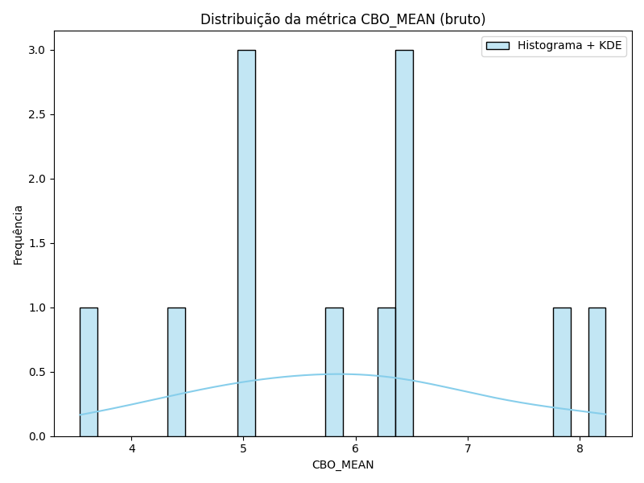
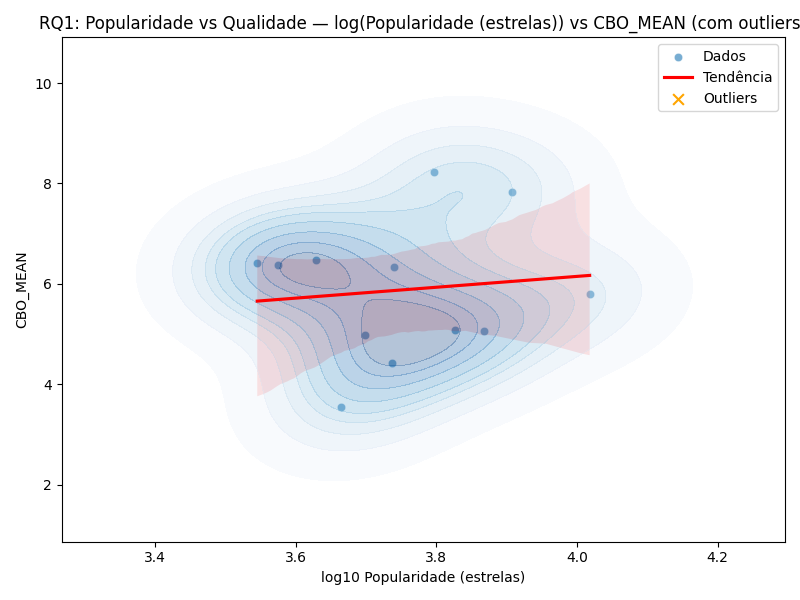
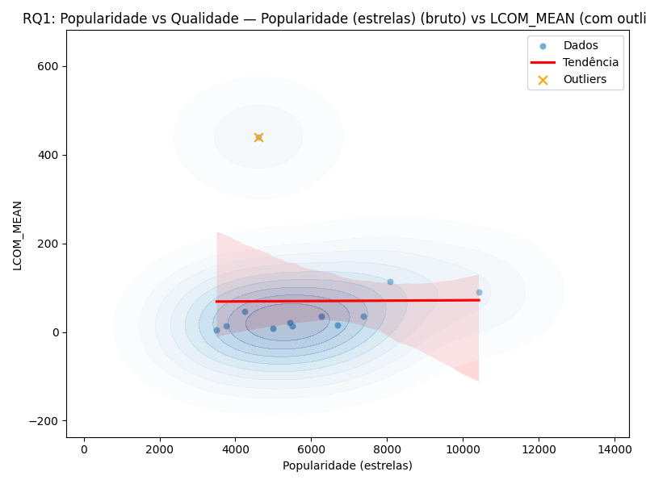

# Estudo das Características de Qualidade de Sistemas Java

**Curso:** Engenharia de Software  
**Disciplina:** Laboratório de Experimentação de Software  
**Professor:** Danilo  
**Período:** 6º  
**Equipe:** Victor Reis Carlota e Luís Felipe Brescia  

---

## Sumário

1. [Resumo](#resumo)
2. [Introdução](#introdução)
3. [Metodologia](#metodologia)
    - 3.1 Seleção de Repositórios
    - 3.2 Coleta de Dados e Métricas
    - 3.3 Abordagem Computacional e Desafios
4. [Hipóteses](#hipóteses)
5. [Resultados](#resultados)
    - 5.1 Distribuição das Métricas de Qualidade
    - 5.2 RQ1: Popularidade vs Qualidade
    - 5.3 RQ2: Maturidade vs Qualidade
    - 5.4 RQ4: Tamanho vs Qualidade
6. [Discussão](#discussão)
7. [Conclusão](#conclusão)
8. [Referências](#referências)

---

## Resumo

Este relatório apresenta uma análise profunda sobre como as características do processo de desenvolvimento — popularidade, maturidade, atividade e tamanho — influenciam atributos de qualidade interna em projetos Java open-source hospedados no GitHub. Usando métricas extraídas pela ferramenta CK e dados coletados via API, buscamos responder como essas variáveis se relacionam e levantamos hipóteses sobre sua influência, além de discutir implicações práticas e filosóficas para a Engenharia de Software.

---

## Introdução

A dinâmica colaborativa dos sistemas open-source impõe desafios significativos à manutenção da qualidade interna do software, especialmente em relação à modularidade, manutenibilidade e legibilidade. Em repositórios Java do GitHub, onde o código evolui de forma coletiva e distribuída, torna-se fundamental entender como práticas e características do processo impactam métricas clássicas de qualidade. Este estudo analisa 1.000 dos repositórios Java mais populares, buscando respostas para quatro questões centrais:

- **RQ 01:** Qual a relação entre a popularidade dos repositórios e suas características de qualidade?
- **RQ 02:** Qual a relação entre a maturidade dos repositórios e suas características de qualidade?
- **RQ 03:** Qual a relação entre a atividade dos repositórios e suas características de qualidade?
- **RQ 04:** Qual a relação entre o tamanho dos repositórios e suas características de qualidade?

Além da análise estatística, exploramos reflexões filosóficas e matemáticas, integrando diversos olhares para além do técnico.

---

## Metodologia

### 3.1 Seleção de Repositórios

O primeiro passo consistiu na seleção dos 1.000 repositórios Java mais populares do GitHub, utilizando filtros de idioma e ordenação por número de estrelas. Essa estratégia buscou garantir que a amostra fosse representativa, diversa e relevante, incluindo desde projetos amplamente adotados pela comunidade até exemplos menos conhecidos, mas tecnicamente significativos.

### 3.2 Coleta de Dados e Métricas

Para cada repositório, extraímos variáveis de processo e métricas de qualidade. As métricas CK adotadas são amplamente reconhecidas por sua capacidade de capturar aspectos essenciais do design orientado a objetos:

- **Popularidade:** número de estrelas, um indicativo de reconhecimento e adoção.
- **Maturidade:** idade do repositório, medida em anos desde o primeiro commit.
- **Tamanho:** linhas de código (LOC) e linhas de comentários, como proxy da complexidade.
- **CBO (Coupling Between Objects):** Representa o grau de acoplamento entre as classes do sistema, ou seja, quantas outras classes cada classe está diretamente conectada. Um alto valor de CBO indica que o sistema possui dependências complexas, o que pode dificultar a manutenção e evolução do código.
- **DIT (Depth of Inheritance Tree):** Mede a profundidade da árvore de herança para cada classe, ou seja, quantos níveis de herança existem desde a raiz até a classe. Valores elevados de DIT podem indicar maior reutilização de código por herança, mas também aumentam a complexidade e o risco de efeitos colaterais em alterações.
- **LCOM (Lack of Cohesion of Methods):** Indica o grau de coesão dos métodos dentro das classes. Um valor alto de LCOM significa que os métodos de uma classe têm pouca relação entre si, sugerindo baixa coesão, o que dificulta a manutenção e pode sinalizar oportunidades de refatoração.

A coleta foi feita via scripts Python utilizando a API REST do GitHub e a ferramenta CK, que gera arquivos `.csv` com métricas detalhadas por repositório.

### 3.3 Abordagem Computacional e Desafios

A execução do estudo impôs barreiras técnicas e metodológicas que exigiram adaptações e refinamentos constantes. O volume de dados, por si só, tornou necessário o desenvolvimento de rotinas automáticas robustas para download, extração, análise e sumarização dos dados. Muitos repositórios apresentavam estruturas de diretórios e arquivos distintas, demandando estratégias flexíveis de identificação dos arquivos Java e tratamento de exceções para casos de métricas ausentes.

Além disso, a dispersão dos dados — marcada por outliers e distribuições assimétricas — exigiu o uso de transformações logarítmicas para variáveis como estrelas, idade e LOC, permitindo uma análise gráfica e estatística mais precisa. Para cada repositório, calculamos medidas centrais (média, mediana e desvio padrão) das métricas de qualidade, proporcionando uma visão estatística confiável sobre o comportamento dos projetos analisados.

---

## Hipóteses

A pesquisa foi guiada por hipóteses desenvolvidas a partir de um olhar crítico sobre a literatura e prática em Engenharia de Software:

- **Popularidade x Qualidade:** Projetos populares são mais revisados e, portanto, devem apresentar melhores métricas de qualidade interna.
- **Maturidade x Qualidade:** A evolução ao longo do tempo favorece refatorações e aprimoramentos, resultando em melhor qualidade nos projetos mais antigos.
- **Tamanho x Qualidade:** O aumento da complexidade, medido em LOC, tende a dificultar a modularidade e coesão, elevando métricas como CBO e LCOM.
- **Atividade x Qualidade:** Projetos com maior número de releases refletem maior dinamismo e potencial para práticas de engenharia mais eficazes.

Essas hipóteses guiaram tanto a coleta quanto a análise dos dados, servindo como referência para avaliação dos resultados.

---

## Resultados

### 5.1 Distribuição das Métricas de Qualidade

Iniciamos os resultados examinando como as métricas de qualidade se distribuem entre os repositórios selecionados. Observa-se que o CBO médio se concentra em valores baixos, mas com cauda longa, indicando alguns projetos com alto acoplamento e complexidade.

No caso do DIT médio, há uma concentração entre 1.0 e 2.5, sugerindo que a maioria dos projetos possui hierarquias de herança relativamente rasas, mas com alguns exemplos mais profundos.

*Distribuição da métrica DIT_MEAN - mostra concentração em valores entre 1.0 e 2.5*  

Já o LCOM apresenta alta concentração próxima a zero, mas também alguns outliers expressivos, reforçando o desafio de manter coesão à medida que os projetos crescem.

As variáveis de processo foram transformadas logarítmicamente para permitir comparações mais justas e visualizações mais claras — por exemplo:

---

### 5.2 RQ1 – Popularidade vs Qualidade

#### Popularidade vs CBO

A relação entre popularidade (estrelas) e acoplamento (CBO) mostrou-se mais complexa do que o esperado. Embora exista uma leve tendência positiva, os dados apresentam grande dispersão e muitos outliers, evidenciando que projetos populares podem ter tanto baixo quanto alto acoplamento.

O uso da escala logarítmica permite observar que, mesmo entre projetos com popularidade similar, há grande variação no CBO, reforçando a ideia de que popularidade não é indicativo direto de qualidade estrutural.

#### Popularidade vs DIT

Ao analisar a profundidade da árvore de herança (DIT) em função da popularidade, notamos que os valores se concentram em faixas estreitas, sem relação estatística significativa com o número de estrelas.

#### Popularidade vs LCOM

A falta de coesão (LCOM) apresentou os outliers mais extremos em relação à popularidade, indicando que projetos muito populares podem tanto ser altamente coesos quanto extremamente dispersos, dependendo de fatores arquiteturais e de equipe.

---

### 5.3 RQ2 – Maturidade vs Qualidade

#### Maturidade vs CBO

Projetos mais antigos mostraram maior variação nos valores de CBO, sugerindo que o tempo pode levar tanto a aprimoramentos quanto ao acúmulo de complexidade e acoplamento, dependendo do histórico de evolução do projeto.

#### Maturidade vs DIT

A evolução arquitetural se manifesta na tendência de projetos maduros apresentarem árvores de herança ligeiramente mais profundas, o que pode refletir tanto refatorações positivas quanto acúmulo de estruturas complexas.

#### Maturidade vs LCOM

No caso da coesão, não foi encontrada relação forte com a idade do projeto. Projetos de diferentes idades apresentam ampla variação nos valores de LCOM, sugerindo ser uma métrica sensível a fatores específicos de design e organização do código.

---

### 5.4 RQ4 – Tamanho vs Qualidade

#### Tamanho vs DIT

Projetos maiores tendem a apresentar estruturas de herança mais complexas e profundas, possivelmente como resposta à necessidade de organizar um volume maior de funcionalidades e abstrações.

#### Tamanho vs LCOM

A relação entre tamanho e falta de coesão é a mais forte e evidente do estudo. Projetos extensos apresentam significativamente maior LCOM, confirmando a hipótese de que a complexidade estrutural dificulta a manutenção de coesão entre métodos e classes.

---

## Discussão

Os resultados deste estudo revelam nuances profundas nas relações entre características de processo e qualidade interna dos projetos Java open-source. A popularidade, ao contrário do que se poderia supor, não se traduz em qualidade arquitetural superior: projetos amplamente conhecidos podem apresentar problemas significativos de acoplamento e coesão, enquanto outros menos populares mantêm padrões elevados de engenharia.

A maturidade do projeto, medida pela idade, carrega ambiguidade. Por um lado, o tempo permite refatorações, aprimoramentos e acúmulo de conhecimento; por outro, pode também implicar em dívidas técnicas, estruturas rígidas e acoplamento indesejado. O tamanho do projeto se destaca como o fator de maior impacto: sistemas extensos enfrentam desafios crescentes de modularidade e coesão, evidenciados pelo aumento de LCOM e DIT. Isso reforça a necessidade de práticas constantes de revisão, refatoração e divisão modular, especialmente em projetos que crescem rapidamente ou acumulam funcionalidades ao longo do tempo.

Do ponto de vista prático, esses achados sugerem que equipes de desenvolvimento devem manter um olhar crítico e contínuo sobre as métricas de qualidade interna, adotando-as como ferramentas essenciais para a tomada de decisão e evolução do projeto. Não basta confiar no sucesso externo ou na popularidade para garantir qualidade. Projetos grandes e maduros exigem estratégias específicas de modularização, organização e revisão arquitetural.

Entre as limitações do estudo, destacam-se o foco em métricas estruturais clássicas, sem análise de fatores qualitativos como padrões de projeto, cultura organizacional e práticas de desenvolvimento, além do recorte apenas em projetos populares no GitHub, o que pode deixar de fora outras dinâmicas relevantes de projetos menos conhecidos ou privados.

---

## Conclusão

Ao final do estudo, conclui-se que as relações entre processo de desenvolvimento e qualidade interna são complexas e multifatoriais. Popularidade e maturidade influenciam menos do que se imaginava, enquanto o tamanho do projeto se mostra o principal desafio para a manutenção da coesão e modularidade. Métricas como CBO, DIT e LCOM são fundamentais para mapear e monitorar a evolução dos sistemas, mas devem ser complementadas por análises qualitativas e práticas colaborativas de engenharia.

Este trabalho reforça a importância de uma abordagem integrada, que combine análise técnica, estatística e filosófica, promovendo sistemas eficientes, legíveis e sustentáveis. Espera-se que os resultados sirvam de alerta e inspiração para equipes preocupadas não apenas com o sucesso externo dos seus projetos, mas principalmente com sua qualidade interna e longevidade.

---

## Referências

- F. Brito e R. Oliveira, "CK: A Tool for Calculating Code Metrics in Java Projects", 2018.
- S. McConnell, "Code Complete: A Practical Handbook of Software Construction", Microsoft Press, 2004.
- E. Gamma et al., "Design Patterns: Elements of Reusable Object-Oriented Software", Addison-Wesley, 1994.
- GitHub REST API Documentation: https://docs.github.com/en/rest
- Engenharia de Software Moderna, Ian Sommerville, 10ª edição, Pearson.
- Martin, R. C. (2008). Clean Code: A Handbook of Agile Software Craftsmanship. Prentice Hall.
- Fowler, M. (2018). Refactoring: Improving the Design of Existing Code. Addison-Wesley.